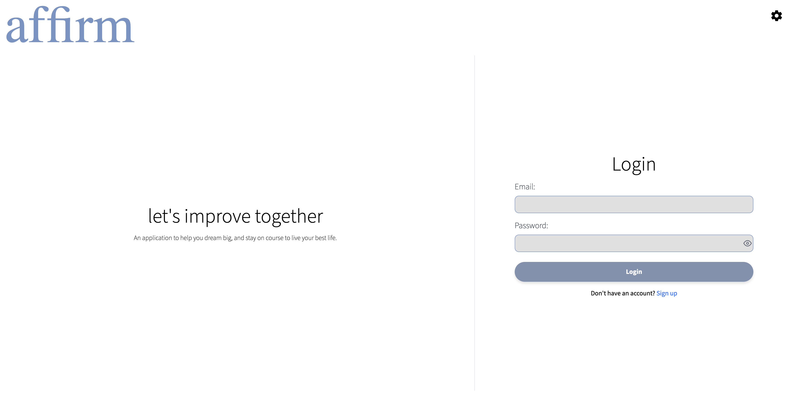

  # Affirm - A Journaling App

  
  
  
  
  
  
  


  ## Description

  JournalApp is a comprehensive journaling application designed to help users goal through their days. It provides a platform for users to record their daily affirmations and track their progress over time.

  ## Deployment
  https://affirm.onrender.com

  ## App Snapshot
  

  ## Features

  - User authentication
  - Daily journal entries
  - Goal tracking
  - Speech to Text

  ## Installation

  To install all dependencies for both the client and server, run the following command:

  ```sh
  npm run install-all
  ```

  This will install all necessary dependencies listed in the \`package.json\` files of both the client and server.

  ## Running the Application

  To start the application in development mode, run:

  ```sh
  npm run dev
  ```

  This will start both the client and server concurrently.

  To start the application in production mode, first build the client:

  ```sh
  npm run build
  ```

  Then start the server:

  ```sh
  npm start
  ```

  ## Formatting

  To format all files in the project, run:

  ```sh
  npm run format
  ```

  This will format all JavaScript, TypeScript, CSS, and HTML files using Prettier.

  ## Contributing

  Contributions are welcome! Please fork this repository and open a pull request with your changes.

  ## License

  This project is licensed under the MIT License.

  

